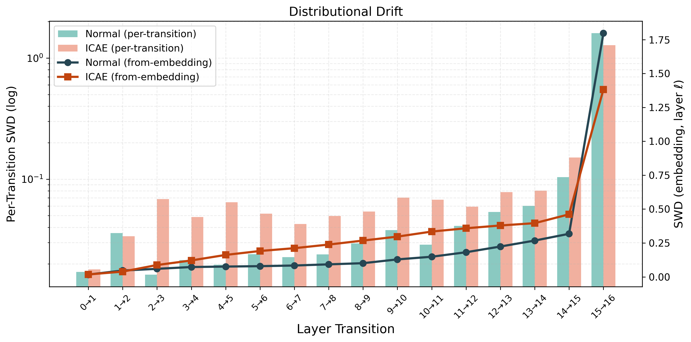
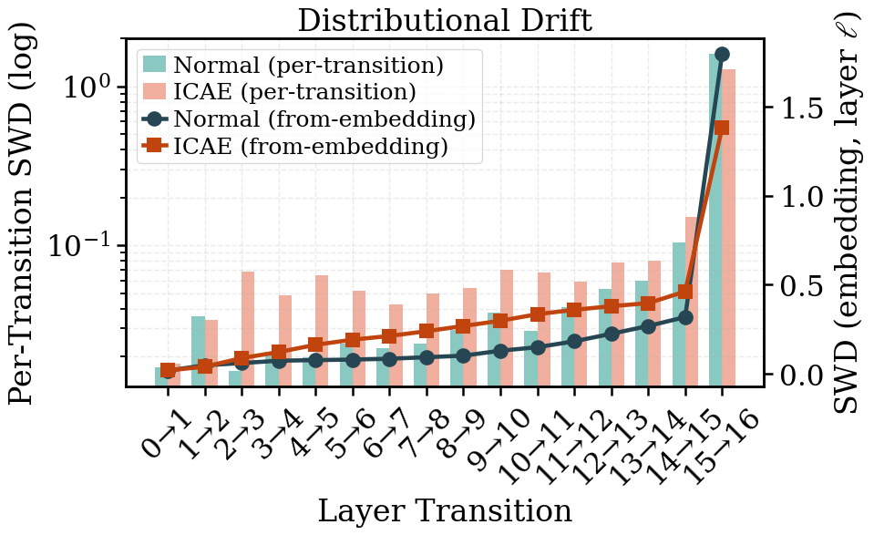

# science-plot-formatter

A Claude Code plugin that beautifies matplotlib scripts for scientific paper submission.

## What it does

Given an existing `.py` plotting script, a target conference/journal, and the figure's fraction of column width on the page, the plugin renders the chart, inspects it critically, rewrites the visual system (figsize, fonts, linewidths, markers, ticks, legend weight), and re-renders to verify the result. It always renders **before** editing and **again after** editing — no code is rewritten from equations alone.

## Skill

- **`beautify-chart`** — the render → inspect → rewrite → re-render → verify loop. The skill looks up the venue's official author guidelines live (column width, body font size, required font family) and derives the target visual system from the figure's final physical width on the page, not from the current code values.

## Usage

Ask Claude Code something like:

> Beautify `path/to/plot.py` for NeurIPS 2026. It's one full column wide.

The skill will:

1. Look up NeurIPS 2026 author guidelines (column width, body pt).
2. Render the script headlessly (`MPLBACKEND=Agg`) and read the PNG.
3. List concrete visual issues at the target page width.
4. Propose a unified `plt.rcParams.update({...})` block plus per-call fixes (errorbar `capsize`/`capthick`, stale kwargs removed).
5. Apply the edits, re-render, and verify each listed issue is resolved.

Data, colors, colormaps, linestyles, axis limits, and the user's composition are never touched.

## Inputs

| Input | Example |
|---|---|
| `script_path` | `/path/to/plot.py` |
| `venue` | `NeurIPS 2026`, `Nature Communications`, `ICML 2026` |
| `fraction` | `0.5` (half column), `1.0` (one column), `2.0` (double columns) |

You do not need to supply column widths or body font sizes — the skill looks them up from the venue.

## Requirements

- Python with `matplotlib` installed on the machine running Claude Code.
- The user's script must be runnable end-to-end (data loadable from the script's working directory).

## Example

  
  

